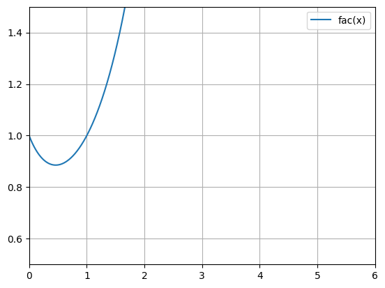

# Chplot - Arbitrary functions plotting and computations

Chplot is a Python >= 3.9 module to plot any arbitrary mathematical expressions as well as data series from files, and compute its derivatives and integrals, where it equals zero, linear and non-linear regressions, and much more !

<p align="center">
  
</p>

## Installation

You can install `chplot` through Pypi, with the command:
```bash
python -m pip install chplot
```

You can also install it by cloning this repo and installing it directly:
```bash
git clone https://github.com/charon25/Chplot.git
cd Chplot
python -m pip install .
```

To check it is properly installed, just run and check it outputs the current version:
```bash
python -m chplot --version
```

This module requires the following third-party modules:
- matplotlib >= 3.6.1
- mpmath >= 1.2.1
- numpy >= 1.23.4
- scipy >= 1.9.3
- [shunting_yard](https://pypi.org/project/shunting-yard/) >= 1.0.12
- tqdm >= 4.64.1

## Usage

In the rest of this README, the term "expression" will refer to any mathematical expression, possibly with one variable (by default `x` but can be changed).

### From a CLI

This module is primarly intended to be used in the command-line. To do this, use the following command:
```bash
python -m chplot [expression1, [expression2, ...]] [additional-parameters...]
```

Where all the additional parameters are documented in the [CLI options](#cli-options) section. Note that there can be no expression, as data can come from other sources.

A lot of examples are given in the [Examples](#graph-and-computations-examples) section.

#### Important note

You need to surround any expression with double quotes (`"`) if it contains a space (` `). Furthermore, due to the working of the `argparse` Python module and the majority of shells, you may have to surround any expression with double quotes (`"`) if it contains a caret (`^`). Finally, if it starts with a dash (`-`) you may also need to add a space (` `) or a `0` before it.
For instance, you need to write `" -x"` or `"0-x"` to get the function `f(x) = -x` and `"x^2"` (instead of just `x^2`) to get the square function.

### From Python code

The `chplot` module can also be used from another program. Code snippets:
```python
# Use this to use the built-in PlotParameters class
import chplot

parameters = chplot.PlotParameters()
chplot.plot(parameters)
```

```python
# Use this to use another object and set default values
import chplot

parameters = ... # any object
chplot.set_default_values(parameters) # add any missing field with its default value

chplot.plot(parameters)
```

All the `PlotParameters` arguments are summarized in the [CLI options](#cli-options) section.

### CLI options

No option is mandatory.

| <div style="width:125px">CLI options</div> | `PlotParameters` class equivalent | Expected arguments | Effect |
|---------------------|--------------------------------------------|---------------------------------------------------------------------------|---------------------------------------------------------------------------------------------------------------------------------------------------------------------------------------------------------------------------------------------------------------------------------------------------------------------------------------------------------------------------------------------------------------|
| $\emptyset$ | expressions: list[str] | Any number of expressions (including none of them) or filepaths | The expressions of the mathematical functions to plot and do computations on. If using the CLI, filepaths can also be provided, and  There can by none of them. |
| `-v`<br>`--variable` | variable: str | One string | The variable going of the horizontal axis. Can be more than one character. Note that the variable will override any constant of function with the same name. Defaults to `x`. |
| `--no-sn` | disable_scientific_notation: bool | $\emptyset$ | Disable the automatic conversion of scientific notation in every expression (e.g. `1.24e-1` to `1.24*10^(-1)`). Defaults to False. |
| `-n`<br>`--n-points` | n_points: int | One positive integer (excluding zero) | The number of points on the horizontal axis for the plotting of the expressions. Defaults to 10001. |
| `-i`<br>`--integers` | is_integer: bool | $\emptyset$ | Forces the points where the expressions are computed to be integers between the specified limits. The number of points will not exceed what is specified with the `-n` parameter. Defaults to False. |
| `-x`<br>`--x-lim` | x_lim: tuple[float&#124;str&#124;None, float&#124;str&#124;None] | Two expressions | The horizontal axis bounds (inclusive) where the expression are computed. First argument is the min, second is the max. Any expression (such as `2pi` or `1+exp(2)`) is valid. It is also the graph default horizontal axis, but they can be automatically adjusted to accomodate the plotted data. Defaults to `0 1`. |
| `-xlog`<br>`--xlog` | is_x_log: bool | $\emptyset$ | Forces a logarithmic scale on the horizontal axis. If some horizontal axis bounds are negative, will modify them. Defaults to False. |
| `-y`<br>`--y-lim` | y_lim: tuple[float&#124;str&#124;None, float&#124;str&#124;None] | Two expressions | The vertical axis bounds (inclusive) of the graph. First argument is the min, second is the max. Any expression (such as `2pi` or `1+exp(2)`) is valid. If not specified, will use matplotlib default ones to accomodate all data. Will restrict the graph to them is specified. |
| `-z`<br>`--y-zero` | must_contain_zero: bool | $\emptyset$ | Forces the vertical axis to contain zero. Defaults to False. |
| `-ylog`<br>`--ylog` | is_y_log: bool | $\emptyset$ | Forces a logarithmic scale on the vertical axis. If some vertical axis bounds are negative, will modify them. Defaults to False. |
| `-xl`<br>`--x-label` | x_label: str | One string | Label of the horizontal axis. Defaults to nothing. |
| `-yl`<br>`--y-label` | y_label: str | One string | Label of the vertical axis. Defaults to nothing. |
| `-t`<br>`--title` | title: str | One string | Title of the graph. Defaults to nothing. |
| `-rl`<br>`--remove-legend` | remove_legend: bool | $\emptyset$ | Removes the graph legend. Defaults to False. |
| `--no-plot` | no_plot: bool | $\emptyset$ | Does not show the plot. However, does not prevent saving the figure. Defaults to False. |
| `-dis`<br>`--discontinuous` | markersize: int&#124;None | One optional positive integer (excluding zero) | Transforms the style of the graph from a continuous line to discrete points with the specified radius. If present without a value, will defaults to a radius of 1. If the `--integer` parameter is also present, will still affect the points radius. |
| `--square` | square_graph: bool | $\emptyset$ | Forces the graph to be a square (aspect ratio of 1). Defaults to False. |
| `-lw`<br>`--line-width` | line_width: float | One positive float (excluding zero) | Width of the plotted functions. Will not affect regressions. Defaults to 1.5 (`matplotlib` defaut). |
| `-c`<br>`--constants` | constants: list[str] | One string or more, either a filepath or of the forme `<name>=<expression>` | Adds constants which may be used by any other expressions (including axis bounds). They must either be of the form `<name>=<expression>` (eg `a=4sin(pi/4)`) or be filepath containing lines respecting this format. Note that filepaths are only accepted in the CLI. May override already existing constants and functions. If a constant refers to another one, it should be defined after. Defaults to nothing. |
| `-f`<br>`--files` | data_files: list[str] | One or more filepaths | Adds data contained in CSV files as new functions to the graph. See the [CSV files format](#csv-files-format) section for more details. Defaults to nothing. |
| `-s`<br>`--save-graph` | save_figure_path: str | One filepath | Saves the graph at the specified path. If not included, will not save the figure (default behavior). |
| `-d`<br>`--save-data` | save_data_path: str | One filepath | Saves the graph data (x and y values) at the specified path in CSV format. If not included, will not save the data (default behavior). |
| `-p`<br>`--python-files` | python_files: list[str] | One or more filepaths | Adds functions contained in Python files. See the [Additional Python function format](#additional-python-function-format) section for more details. Defaults to nothing. |
| `--zeros` | zeros_file: str&#124;None | One optional filepath | Computes where the expressions equal zero. If not included, will not compute it (default behavior), else if included without argument, prints the results to the console, else writes it to the given file. |
| `-int`<br>`--integral` | integral_file: str&#124;None | One optional filepath | Computes the integral of all functions on the entire interval where it is plotted. Note that it does **not** add the antideritive of the functions to the graph, but only computes the area under them on their definition interval. If not included, will not compute it (default behavior), else if included without argument, prints the results to the console, else writes it to the given file. |
| `-deriv`<br>`--derivative` | derivation_orders: list[int] | At least one positive integer (excluding zero) | Computes and adds to the graph the derivative of the specified orders of every other function. Note that the higher the order, the more inaccuracy and unstability it has. Furthermore, the derivative computation will shave off a few points on each side, so the derivatives are defined on a smaller interval. |
| `-reg`<br>`--regression` | regression_expression: str | One expression | Computes the coefficients of the given regression to get the best fit to every other function. The regression parameters should have the form `_rX` where X is any string made of digits, letters and underscores and starting with a letter (eg `_ra0`). The regressions will also be added in the final graph. When using the CLI, the expression can also be one of a few default keywords (listed in [Regression default keywords](#regression-default-keywords)). |

### Options synergies

Every option that computes something based on the functions will act on every function defined before it applies. The order of application is the following (each item applies to all the previous ones):
- Base expressions & file data
- Regressions
- Derivations
- Integrals & zeros

For instance, this means every regression will also be derivated, and every derivative will be integrated.

### CSV files format

The `--file` option will accept any CSV file respecting those rules:
- the column delimiter is eitehr a comma (`,`), a semicolon (`;`), a space (` `) or a tabulation (`\t`) ;
- the decimal separator is either a dot (`.`) or a comma (`,`) if the column delimiter is something else (for countries and language using them, such as French or German) ;
- text entry containing the column delimiter must be surrounded by double quotes (`"`) ;
- to have double quotes (`"`) in a text entry, just double them (`""`).

The first column will be considered the horizontal axis data for the entire file. Each subsequent column will be a new function. They might all be of different lengths, and some value may be missing. Any missing value in the first column will ignore the whole line.

The first non numerical line will be used as label for the functions.

#### Examples

The file
```csv
x,"First y","Second ""y""",ThirdY,EmptyColumn
0,0,,0,
1,10,100,,
2,20,,2000,
3,30,300,3000,
4,40,400,,
```
Will result in the following functions (represented as (x,y) couples):
- `First y`: (0, 0), (1, 10), (2, 20), (3, 30), (4, 40)
- `Second "y"`: (1, 100), (3, 300), (4, 400)
- `ThirdY`: (0, 0), (2, 2000), (3, 3000)

Note that the last column does not have any values, so it won't be registered at all.

The file
```csv
x;y1;y2
0,0;1,0;2,1
0,3;1,2;2,5
0,6;1,55;2,123
1;1,825;2,99
```
Will result in the following functions:
- `y1`: (0, 1), (0.3, 1.2), (0.6, 1.55), (1, 1.825)
- `y2`: (0, 2.1), (0.3, 2.5), (0.6, 2.123), (1, 2.99)


### Regression default keywords

When using Chplot from the command line and using the `--regression` command, a keyword can be specified instead of an expression to get usual regression expression. Those keywords are listed below :

| Keyword | <div style="width:300px">Mathematical function</div> | Equivalent expression |
|-------|:-------------------:|:-------------------:|
| `const`<br>`constant` | $f(x) = m$ | `_rm` |
| `lin`<br>`linear` | $f(x) = ax + b$ | `_ra * x + _rb` |
| `pN`<br>`polyN`<br>`polynomialN`<br>where $N \in \mathbb{N} $ | $$f(x) = \sum_{i=0}^N a_i x^i$$ | `_ra0`<br>`_ra1 * x + _ra0`<br>`_ra2 * x^2 + _ra1 * x + _r0`<br>`...` |
| `power` | $f(x) = k x^\alpha$ | `_rk * x^_ralpha` |
| `powery` | $f(x) = k x^\alpha + y_0$ | `_rk * x^_ralpha + r_y0` |
| `log` | $f(x) = a \ln(x) + b$ | `_ra * ln(x) + _rb` |
| `exp` | $f(x) = a \mathrm{e}^{bx}$ | `_ra * exp(x * _rb)` |
| `expy` | $f(x) = a \mathrm{e}^{bx} + y_0$ | `_ra * exp(x * _rb) + _ry0` |

Note that `poly0` is equivalent to `constant` and `poly1` is equivalent to `linear`.

### Additional Python function format

Chplot expression can accept functions usable in any expression directly from other Python files. Those file must respect those rules:
- they must be in the same directory as the console when using the CLI (and in the same directory as the python execution when using the code version [NOT TESTED]) ;
- all functions to add must be decorated with the `@plottable` decorator (importable with `from chplot import plottable`). The decorator **must** indicate how many arguments is expected by the function, either directly or with the `arg_count` keyword (i.e. `@plottable(1)` or `@plottable(arg_count=2)`) ;
- all functions must only accept `int` or `float` and must only return **one** value accepted by the `float()` built-in function of Python, such as, but not limited to, `int`, `float` or `bool` (if not, will be considered as the same as a raised Exception) ;
- to indicate an error in the computation (such as a division by zero or the square root of a negative number), the function can either raise an exception or return `math.nan` (or `float('nan')`). Note that an exception will completely stop the computation at that point while `nan` will be used in the rest of the expression, which may change the result slightly.

Everything other than those rules is allowed, such as importing other modules.
The name of the Python function will be the same as the name used in the expression.

#### Examples

The Python file `functions.py`
```python
from chplot import plottable
import math

@plottable(1)
def inc(x: float) -> float:
 return x + 1

@plottable(arg_count=2)
def invradius(x: float, y: float) -> float:
 if x == y == 0:
    raise ZeroDivisionError
 
 return 1 / math.sqrt(x * x + y * y)

def dec(x: float) -> float:
 return x - 1

@plottable
def double(x: float) -> float:
 return x * 2
```
Will define **2** new functions usable in expression: `inc` and `invradius`. `dec` does not have the decorator and will be ignored, and `double` does not indicate how many parameters it accepts, and therefore will also be ignored (but a warning will be logged).

This means, the following command is valid:
```bash
python -m chplot "inc(invradius(x, 5))" -x 1 inc(2) -p functions.py
```

## Available functions

Chplot is bundled by default with more than 60 mathematical and physical constants and over 200 mathematical functions from the default `math` module, `scipy.special`, `mpmath` as well as custom made ones. They are all described in the following sections. The documentation of functions from `math` or the third-party modules can be found in their respective wikis: [math](https://docs.python.org/3/library/math.html), [scipy.special](https://docs.scipy.org/doc/scipy/reference/special.html), [mpmath](https://mpmath.org/doc/current/).

There are also the 5 base operations : `+`, `-`, `*`, `/`, `^`.

### Constants

`nan` and `_` are valid constants that both evaluates to `math.nan`. They can be used to remove some points from the graph (for instance with the `if` or `in` functions, see below). `inf` is also a valid constant evaluating to `math.inf`.

#### Mathematical constants

| `chplot` name | Name | Usual symbol | Exact value | `chplot` value |
|-------------|---------------------------|:----------:|:---------:|:---------------:|
| `pi` | Pi | $\pi$ | $\pi$ | $3.141\ 592\ 653\ 589\ 793$ |
| `tau` | Tau | $\tau$ | $2\pi$ | $6.283\ 185\ 307\ 179\ 586$ |
| `e` | Euler's number | $e$ | $$\exp(1) = \sum_{n=0}^{+\infty} \frac{1}{n!}$$ | $2.718\ 281\ 828\ 459\ 045$ |
| `ga`<br>`em` | Euler-Mascheroni's constant | $\gamma$ | $$\lim_{n\to\infty} \left( \sum_{k=1}^n \left( \frac{1}{k}\right) - \log n \right)$$ | $0.577\ 215\ 664\ 901\ 532 9$ |
| `phi` | Golden ratio | $\phi$ | $\frac{1}{2} (1 + \sqrt{5})$ | $1.618\ 033\ 988\ 749\ 895$ |
| `sqrt2` | Square root of 2 | $\sqrt{2}$ | $\sqrt{2}$ | $1.414\ 213\ 562\ 373\ 095\ 1$ |
| `apery` | Apery's constant | | $$\zeta(3) = \sum_{n=1}^{+\infty} \frac{1}{n^3} $$ | $1.202\ 056\ 903\ 159\ 594$ |
| `brun` | Brun's constant | $B_2$ | Sum of the reciprocal of the twin primes | $1.902\ 160\ 583\ 104$ |
| `catalan` | Catalan's constant | $G$ | $$\sum_{n=0}^{+\infty} \frac{(-1)^n}{(2n + 1)^2} $$ | $0.915\ 965\ 594\ 177\ 219$ |
| `feigenbaumd` | First Feigenbaum's constant | $\delta$ | | $4.669\ 201\ 609\ 102\ 990\ 67$ |
| `feigenbauma` | Second Feigenbaum's constant | $\alpha$ | | $2.502\ 907\ 875\ 095\ 892\ 82$ |
| `glaisher` | Glaisher-Khinkelin's constant | $A$ | $$\lim_{n\to\infty} \frac{\Pi_{k=1}^{n} k^k}{n^{\frac{n^2}{2} + \frac{n}{2} + \frac{1}{12}}\cdot\mathrm{e}^{-\frac{n^2}{4}}}$$ | $1.282\ 427\ 129\ 100\ 622\ 6$ |
| `khinchin` | Khinchin's constant | $K_0$ | $$\prod_{r=1}^{+\infty} \left(1 + \frac{1}{r(r+2)} \right)^{\log_2 r}$$ | $2.685\ 452\ 001\ 065\ 306\ 2$ |
| `mertens` | Meissel-Mertens's constant | $M$ | $$\gamma + \sum_{p\text{ prime}}\left(\ln\left(1 - \frac{1}{p}\right) + \frac{1}{p} \right)$$ | $0.261\ 497\ 212\ 847\ 642\ 77$ |

#### Physical constants

The constants, their values and their units are taken from https://en.wikipedia.org/wiki/List_of_physical_constants.

| `chplot` name | Quantity | Symbol | `chplot` value (in SI units) | Units |
|-------------|----|:----:|:------------:|:---:|
| `a0`       | Bohr's radius | $a_0$ | $5.291\ 772\ 109\ 03\times10^{-11}$ | $\text{m}$ |
| `alpha`    | Fine-structure constant | $\alpha$ | $7.297\ 352\ 569\ 3\times10^{-3}$ | --- |
| `b`        | Wien's wavelength displacement law constant | $b$ | $2.897\ 771\ 955\times10^{-3}$ | $\text{m}\cdot\text{K}$ |
| `bp`       | Wien's entropy displacement law constant | $b_{\text{entropy}}$ | $3.002\ 916\ 077\times10^{-3}$ | $\text{m}\cdot\text{K}$ |
| `bp`       | Wien's frequency displacement law constant | $b'$ | $5.878\ 925\ 757\times10^{10}$ | $\text{Hz}\cdot\text{K}^{-1}$ |
| `c`        | Speed of light in vacuum | $c$ | $2.997\ 924\ 58\times10^8$ | $\text{m}\cdot\text{s}^{-1}$ |
| `c1`       | First radiation constant | $c_1$ | $3.741\ 771\ 852\times10^{-16}$ | $\text{W}\cdot\text{m}^2$ |
| `c1L`      | Second radiation constant | $c_{1L}$ | $1.191\ 042\ 972\ 397\ 188\times10^{-16}$ | $\text{W}\cdot\text{m}^2\cdot\text{sr}^{-1}$ |
| `c2`       | Second radiation constant | $c_2$ | $1.438\ 776\ 877\times10^{-2}$ | $\text{m}\cdot\text{K}$ |
| `dnuCs`    | Hyperfine transistion frequency of Cesium-133 | $\Delta\nu_{\text{Cs}}$ | $9.192\ 631\ 770\times10^{9}$ | $\text{Hz}$ |
| `ec`       | Elementary charge | $e$ | $1.602\ 176\ 634\times10^{-19}$ | $\text{C}$ |
| `Eh`       | Hartree's energy | $E_h$ | $4.359\ 744\ 722\ 207\ 1\times10^{-18}$ | $\text{J}$ |
| `epsilon0`<br>`eps0` | Vacuum electric permittivity    | $\varepsilon_0$ | $8.854\ 187\ 812\ 8\times10^{-12}$ | $\text{F}\cdot\text{m}^{-1}$ |
| `eV`       | Electronvolt value in Joule |  | $1.602\ 176\ 634\times10^{-19}$ | $\text{J}$ |
| `F`        | Faraday's constant | $F$ | $9.648\ 533\ 212\ 331\ 002\times10^4$ | $\text{C}\cdot\text{mol}^{-1}$ |
| `G`        | Gravitational constant | $G$ | $6.674\ 3\times10^{-11}$ | $\text{m}^3\cdot\text{kg}^{-1}\cdot\text{s}^{-2}$ |
| `g`        | Gravity of Earth | $g$ | $9.806\ 65$ | $\text{m}\cdot\text{s}^{-2}$ |
| `G0`       | Conductance quantum | $G_0$ | $7.748\ 091\ 729\times10^{-5}$ | $\text{S}$ |
| `ge`       | Electron g-factor | $g_e$ | $-2.002\ 319\ 304\ 362\ 56$ | --- |
| `GF0`      | Fermi coupling constant<br>Reduced Fermi constant | $$G^0_F$$ | $4.543\ 795\ 7\times10^{14}$ | $\text{J}^{-2}$ |
| `gmu`      | Muon g-factor | $g_\mu$ | $-2.002\ 331\ 841\ 8$ | --- |
| `gP`       | Proton g-factor | $g_P$ | $5.585\ 694\ 689\ 3$ | --- |
| `h`        | Planck's constant | $h$ | $6.626\ 070\ 15\times10^{-34}$ | $\text{J}\cdot\text{Hz}^{-1}$ |
| `hb`       | Reduced Planck's constant | $\hbar$ | $1.054\ 571\ 817\times10^{-34}$ | $\text{J}\cdot\text{s}$ |
| `kB`       | Boltzmann's constant    | $k$, $k_B$ | $1.380\ 649\times10^{-23}$ | $\text{J}\cdot\text{K}^{-1}$ |
| `ke`       | Coulomb's constant    | $k_e$ | $8.987\ 551\ 792\ 3\times10^9$ | $\text{N}\cdot\text{m}^2\cdot\text{C}^{-2}$ |
| `KJ`       | Josephson's constant | $K_J$ | $4.835\ 978\ 484\times10^{14}$ | $\text{Hz}\cdot\text{V}^{-1}$ |
| `m12C`     | Atomic mass of carbon-12 | $m(^{12}\text{C})$ | $1.992\ 646\ 879\ 92\times10^{26}$ | $\text{kg}$ |
| `M12C`     | Molar mass of carbon-12 | $M(^{12}\text{C})$ | $1.199\ 999\ 999\ 58\times10^{-2}$ | $\text{kg}\cdot\text{mol}^{-1}$ |
| `me`       | Electron mass | $m_e$ | $9.109\ 383\ 701\ 5\times10^{-31}$ | $\text{kg}$ |
| `mmu`      | Muon mass | $m_\mu$ | $1.883\ 531\ 627\times10^{-28}$ | $\text{kg}$ |
| `mn`       | Neutron mass | $m_n$ | $1.674\ 927\ 498\ 04\times10^{-27}$ | $\text{kg}$ |
| `mp`       | Proton mass | $m_p$ | $1.672\ 621\ 923\ 69\times10^{-27}$ | $\text{kg}$ |
| `mt`       | Top quark mass | $m_t$ | $3.078\ 4\times10^{-25}$ | $\text{kg}$ |
| `mtau`     | Tau mass | $m_\tau$ | $3.167\ 54\times10^{-27}$ | $\text{kg}$ |
| `mu`       | Atomic mass constant | $m_u$ | $1.660\ 539\ 066\ 6\times10^{-27}$ | $\text{kg}$ |
| `Mu`       | Molar mass constant | $M_u$ | $9.999\ 999\ 996\ 5\times10^{-4}$ | $\text{kg}\cdot\text{mol}^{-1}$ |
| `mu0`      | Vacuum magnetic parmeability    | $\mu_0$ | $1.256\ 637\ 602\ 12\times10^{-6}$ | $\text{N}\cdot\text{A}^{-2}$ |
| `muB`      | Bohr's magneton | $\mu_B$ | $9.274\ 010\ 078\ 3\times10^{-24}$ | $\text{J}\cdot\text{T}^{-1}$ |
| `muN`      | Nuclear magneton | $\mu_N$ | $5.050\ 783\ 746\ 1\times10^{-27}$ | $\text{J}\cdot\text{T}^{-1}$ |
| `NA`       | Avogadro constant | $N_A$ | $6.022\ 140\ 76\times10^{23}$ | $\text{mol}^{-1}$ |
| `R`        | Molar gas constant | $R$ | $8.314\ 462\ 618\ 153\ 24$ | $\text{J}\cdot\text{mol}^{-1}\cdot\text{K}^{-1}$ |
| `re`       | Classical electron radius | $r_e$ | $2.817\ 940\ 326\ 2\times10^{-15}$ | $\text{m}$ |
| `Rinf`     | Rydberg's constant | $R_\infty$ | $1.097\ 373\ 156\ 816\times10^7$ | $\text{m}^{-1}$ |
| `RK`       | Von Klitzing's constant | $R_K$ | $2.581\ 280\ 745\times10^{4}$ | $\Omega$ |
| `Ry`       | Rydberg's unit of energy | $R_y$ | $2.179\ 872\ 361\ 103\ 5\times10^{-18}$ | $\text{J}$ |
| `sigma`    | Stefan-Boltzmann's constant | $\sigma$ | $5.670\ 374\ 419\times10^{-8}$ | $\text{W}\cdot\text{m}^{-2}\cdot\text{K}^{-4}$ |
| `sigmae`   | Thomson's cross section | $\sigma_e$ | $6.652\ 458\ 732\ 1\times10^{-29}$ | $\text{m}^2$ |
| `VmSi`     | Molar volume of silicon | $V_m(\text{Si})$ | $1.205\ 883\ 199\times10^{-5}$ | $\text{m}^3\cdot\text{mol}^{-1}$ |
| `Z0`       | Characteristic impedance of vacuum    | $Z_0$ | $3.767\ 303\ 136 \ 68\times10^2$ | $\Omega$ |


### Astronomical constants

All the planets data are taken from : https://nssdc.gsfc.nasa.gov.

| `chplot` name | Quantity | `chplot` value (in SI units) | Units |
|-------------|----|:------------:|:---:|
| `Msun`       | Sun mass | $1.988\ 5\times10^{30}$ | $\text{kg}$ |
| `Mmercury`   | Mercury mass | $3.301\times10^{23}$ | $\text{kg}$ |
| `Mvenus`     | Venus mass | $4.867\ 3\times10^{24}$ | $\text{kg}$ |
| `Mearth`     | Earth mass | $5.972\ 2\times10^{24}$ | $\text{kg}$ |
| `Mmoon`      | Moon mass | $7.346\times10^{22}$ | $\text{kg}$ |
| `Mmars`      | Mars mass | $6.416\ 9\times10^{23}$ | $\text{kg}$ |
| `Mjupiter`   | Jupiter mass | $1.898\ 13\times10^{27}$ | $\text{kg}$ |
| `Msaturn`    | Saturn mass | $5.683\ 2\times10^{26}$ | $\text{kg}$ |
| `Muranus`    | Uranus mass | $8.681\ 1\times10^{25}$ | $\text{kg}$ |
| `Mneptune`   | Neptune mass | $1.024\ 09\times10^{26}$ | $\text{kg}$ |
| `Mpluto`     | Pluto mass | $1.303\times10^{22}$ | $\text{kg}$ |
| `Mcharon`    | Charon mass | $1.586\times10^{21}$ | $\text{kg}$ |
| | | | |
| `Rsun`       | Sun volumetric mean radius | $6.957\times10^{8}$ | $\text{m}$ |
| `Rmercury`   | Mercury volumetric mean radius | $2.439\ 7\times10^{6}$ | $\text{m}$ |
| `Rvenus`     | Venus volumetric mean radius | $6.051\ 8\times10^{6}$ | $\text{m}$ |
| `Rearth`     | Earth volumetric mean radius | $6.371\times10^{6}$ | $\text{m}$ |
| `Rmoon`      | Moon volumetric mean radius | $1.737\ 4\times10^{6}$ | $\text{m}$ |
| `Rmars`      | Mars volumetric mean radius | $3.389\ 5\times10^{6}$ | $\text{m}$ |
| `Rjupiter`   | Jupiter volumetric mean radius | $6.991\ 1\times10^{7}$ | $\text{m}$ |
| `Rsaturn`    | Saturn volumetric mean radius | $5.8232\times10^{7}$ | $\text{m}$ |
| `Ruranus`    | Uranus volumetric mean radius | $2.536\ 2\times10^{7}$ | $\text{m}$ |
| `Rneptune`   | Neptune volumetric mean radius | $2.462\ 2\times10^{7}$ | $\text{m}$ |
| `Rpluto`     | Pluto volumetric mean radius | $1.188\times10^{6}$ | $\text{m}$ |
| `Rcharon`    | Charon volumetric mean radius | $6.06\times10^{5}$ | $\text{m}$ |
| | | | |
| `AU` | Astronomical unit in meters | $1.495\ 978\ 707\times10^{11}$ | $\text{m}$ |
| `ly` | Light-year in meters | $9.460\ 730\ 472\ 580\ 8\times10^{15}$ | $\text{m}$ |
| `pc` | Parsec in meters | $3.085\ 677\ 581\ 491\ 367\ 3\times10^{11}$ | $\text{m}$ |

### From default `math` module

Documentation: https://docs.python.org/3/library/math.html

| `chplot` name(s) | `math` name | Number of arguments | Notes |
|---------------------|-------------|:-------------------:|:-----:|
| `acos` | `acos` | 1 | |
| `acosh` | `acosh` | 1 | |
| `asin` | `asin` | 1 | |
| `asinh` | `asinh` | 1 | |
| `atan` | `atan` | 1 | |
| `atanh` | `atanh` | 1 | |
| `atan2` | `atan2` | 2 | |
| `cbrt` | `cbrt` | 1 | |
| `ceil` | `ceil` | 1 | |
| `copysign` | `copysign` | 2 | |
| `cos` | `cos` | 1 | |
| `cosh` | `cosh` | 1 | |
| `degrees` | `degrees` | 1 | |
| `dist` | `dist` | 4 | `dist(x1, y1, x2, y2)` is interpreted as `math.dist((x1, y1), (x2, y2))` |
| `erf` | `erf` | 1 | |
| `erfc` | `erfc` | 1 | |
| `exp` | `exp` | 1 | |
| `expm1` | `expm1` | 1 | |
| `floor` | `floor` | 1 | |
| `fmod` | `fmod` | 2 | |
| `gamma` | `gamma` | 1 | |
| `hypot` | `hypot` | 2 | |
| `lgamma`<br>`lngamma` | `lgamma` | 1 | |
| `log`<br>`ln` | `log` | 1 | |
| `log10` | `log10` | 1 | |
| `log1p` | `log1p` | 1 | |
| `log2` | `log2` | 1 | |
| `radians` | `radians` | 1 | |
| `remainder` | `remainder` | 2 | |
| `sin` | `sin` | 1 | |
| `sinh` | `sinh` | 1 | |
| `sqrt` | `sqrt` | 1 | |
| `tan` | `tan` | 1 | |
| `trunc` | `trunc` | 1 | |

### From `scipy.special`

Documentation: https://docs.scipy.org/doc/scipy/reference/special.html

| `chplot` name(s) | `scipy.special` name | Number of arguments | Notes |
|---------------------|-------------|:-------------------:|:-----:|
| `agm` | `agm` | 2 | |
| `Ai` | `airy` | 1 | First output |
| `Aip` | `airy` | 1 | Second output |
| `bei` | `bei` | 1 | |
| `beip` | `beip` | 1 | |
| `ber` | `ber` | 1 | |
| `berp` | `berp` | 1 | |
| `beta` | `beta` | 2 | |
| `betainc` | `betainc` | 3 | |
| `betaincinv` | `betaincinv` | 3 | |
| `betaln` | `betaln` | 2 | |
| `Bi` | `airy` | 1 | Third output |
| `binom`<br>`binomial` | `binom` | 2 | |
| `Bip` | `airy` | 1 | Fourth output |
| `Chi` | `shichi` | 1 | Second output |
| `Ci` | `sici` | 1 | Second output |
| `digamma` | `digamma` | 1 | |
| `eAi` | `airye` | 1 | First output |
| `eAip` | `airye` | 1 | Second output |
| `eBi` | `airye` | 1 | Third output |
| `eBip` | `airye` | 1 | Fourth output |
| `ellipe` | `ellipe` | 1 | |
| `ellipeinc` | `ellipeinc` | 2 | |
| `ellipk` | `ellipk` | 1 | |
| `ellipkinc` | `ellipkinc` | 2 | |
| `elliprc` | `elliprc` | 2 | |
| `elliprd` | `elliprd` | 3 | |
| `elliprf` | `elliprf` | 3 | |
| `elliprg` | `elliprg` | 3 | |
| `elliprj` | `elliprj` | 4 | |
| `erfcinv` | `erfcinv` | 1 | |
| `erfi` | `erfi` | 1 | |
| `erfinv` | `erfinv` | 1 | |
| `factorial`<br>`fac` | `factorial` | 1 | |
| `fresnelc` | `fresnel` | 1 | Second output |
| `fresnels` | `fresnel` | 1 | First output |
| `gammainc` | `gammainc` | 2 | |
| `gammaincc` | `gammaincc` | 2 | |
| `gammainccinv` | `gammainccinv` | 2 | |
| `gammaincinv` | `gammaincinv` | 2 | |
| `hurwitz`<br>`hurwitzzeta` | `zeta` | 2 | |
| `hyp0f1` | `hyp0f1` | 2 | |
| `hyp1f1` | `hyp1f1` | 3 | |
| `hyp2f1` | `hyp2f1` | 4 | |
| `hyperu` | `hyperu` | 3 | |
| `it2struve0` | `it2struve0` | 1 | |
| `itmodstruve0` | `itmodstruve0` | 1 | |
| `itstruve0` | `itstruve0` | 1 | |
| `iv`<br>`besseli` | `iv` | 2 | |
| `jv`<br>`besselj` | `jv` | 2 | |
| `kei` | `kei` | 1 | |
| `keip` | `keip` | 1 | |
| `ker` | `ker` | 1 | |
| `kerp` | `kerp` | 1 | |
| `kv`<br>`besselk` | `kv` | 2 | |
| `lambertw` | `lambertw` | 1 | |
| `loggamma` | `loggamma` | 1 | |
| `modstruve`<br>`struvel` | `modstruve` | 2 | |
| `psi` | `psi` | 1 | |
| `rgamma` | `rgamma` | 1 | |
| `Shi` | `shichi` | 1 | First output |
| `Si` | `sici` | 1 | First output |
| `sincpi` | `sinc` | 1 | |
| `struve`<br>`struveh` | `struve` | 2 | |
| `yv`<br>`bessely` | `yv` | 2 | |
| `zeta` | `zeta` | 1 | |


### From `mpmath`

Documentation: https://mpmath.org/doc/current/

| `chplot` name(s) | `mpmath` name | Number of arguments | Notes |
|---------------------|-------------|:-------------------:|:-----:|
| `acot` | `acot` | 1 | |
| `acoth` | `acoth` | 1 | |
| `acsc` | `acsc` | 1 | |
| `acsch` | `acsch` | 1 | |
| `altzeta`<br>`eta` | `altzeta` | 1 | |
| `angerj` | `angerj` | 2 | |
| `asec` | `asec` | 1 | |
| `asech` | `asech` | 1 | |
| `backlunds` | `backlunds` | 1 | |
| `barnesg` | `barnesg` | 1 | |
| `betainc2` | `betainc` | 4 | |
| `chebyt` | `chebyt` | 2 | |
| `chebyu` | `chebyu` | 2 | |
| `clcos` | `clcos` | 2 | |
| `clsin` | `clsin` | 2 | |
| `cospi`<br>`cospi` | `cospi` | 1 | |
| `cot` | `cot` | 1 | |
| `coth` | `coth` | 1 | |
| `coulombc` | `coulombc` | 2 | |
| `coulombf` | `coulombf` | 3 | |
| `coulombg` | `coulombg` | 3 | |
| `csc` | `csc` | 1 | |
| `csch` | `csch` | 1 | |
| `Ei` | `ei` | 1 | |
| `ellipf` | `ellipf` | 2 | |
| `ellippi` | `ellippi` | 3 | |
| `fac2` | `fac2` | 1 | |
| `ff` | `ff` | 1 | |
| `fib` | `fib` | 1 | |
| `fibonacci` | `fibonacci` | 1 | |
| `gammainc2` | `gammainc` | 3 | |
| `gegenbauer` | `gegenbauer` | 3 | |
| `harmonic` | `harmonic` | 1 | |
| `hermite` | `hermite` | 2 | |
| `hyp1f2` | `hyp1f2` | 4 | |
| `hyp2f0` | `hyp2f0` | 3 | |
| `hyp2f3` | `hyp2f3` | 5 | |
| `hyp3f2` | `hyp3f2` | 6 | |
| `hyperfac` | `hyperfac` | 1 | |
| `jacobi` | `jacobi` | 4 | |
| `laguerre` | `laguerre` | 3 | |
| `legendre` | `legendre` | 2 | |
| `legenp` | `legenp` | 3 | |
| `legenq` | `legenq` | 3 | |
| `lerchphi` | `lerchphi` | 3 | |
| `li` | `li` | 1 | Computes `li(x, offset=False)` |
| `Li` | `li` | 1 | Computes `li(x, offset=True)` |
| `lommels1` | `lommels1` | 3 | |
| `lommels2` | `lommels2` | 3 | |
| `nzetazeros` | `nzeros` | 1 | |
| `pcfd` | `pcfd` | 2 | |
| `pcfu` | `pcfu` | 2 | |
| `pcfv` | `pcfv` | 2 | |
| `pcfw` | `pcfw` | 2 | |
| `polyexp` | `polyexp` | 2 | |
| `polylog` | `polylog` | 2 | |
| `primepi` | `primepi` | 1 | |
| `primezeta` | `primezeta` | 1 | |
| `rf` | `rf` | 1 | |
| `riemannr` | `riemannr` | 1 | |
| `scorergi` | `scorergi` | 1 | |
| `scorerhi` | `scorerhi` | 1 | |
| `sec` | `sec` | 1 | |
| `sech` | `sech` | 1 | |
| `secondzeta` | `secondzeta` | 1 | |
| `siegeltheta` | `siegeltheta` | 1 | |
| `siegelz` | `siegelz` | 1 | |
| `sinc` | `sinc` | 1 | |
| `stieltjes` | `stieltjes` | 1 | |
| `superfac` | `superfac` | 1 | |
| `W` | `lambertw` | 1 | |
| `webere` | `webere` | 2 | |
| `whitm` | `whitm` | 3 | |
| `whitw` | `whitw` | 3 | |

### Probability functions

| `chplot` name | Name | Arguments | Expression |
|---------------|------|:---------:|:----------:|
| `normpdf` | Normal distribution PDF | $x, \mu, \sigma$ | $$\frac{1}{\sigma\sqrt{2\pi}}\mathrm{e}^{-\frac{1}{2}\left(\frac{x - \mu}{\sigma} \right)^2}$$ |
| `normcdf` | Normal distribution CDF | $x, \mu, \sigma$ | $$\frac{1}{2}\left(1 + \mathrm{erf}\left(\frac{x - \mu}{\sigma\sqrt{2}}\right) \right)$$ |
| `unormpdf` | Unit normal distribution PDF | $x$ | $$\frac{1}{\sqrt{2\pi}}\mathrm{e}^{-\frac{x^2}{2}}$$ |
| `unormcdf` | Unit normal distribution CDF | $x$ | $$\frac{1}{2}\left(1 + \mathrm{erf}\left(\frac{x}{\sqrt{2}}\right) \right)$$ |
| `tripdf` | Triangle distribution PDF | $x, a, b, c$ | $$0 \text{ if } x\leq a \text{ or } x > b$$ <br> $$\frac{2(x-a)}{(b-a)(c-a)} \text{ if } a < x\leq c$$ <br> $$\frac{2(b-x)}{(b-a)(b-c)} \text{ if } c < x\leq b$$ |
| `tricdf` | Triangle distribution CDF | $x, a, b, c$ | $$0 \text{ if } x < a$$ <br> $$\frac{(x-a)^2}{(b-a)(c-a)} \text{ if } a\leq x\leq c$$ <br> $$1 - \frac{(b-x)^2}{(b-a)(b-c)} \text{ if } c < x\leq b$$ <br> $$1 \text{ if }b < x $$ |
| `uniformpdf` | Uniform distribution PDF | $x, a, b$ | $$0 \text{ if } x < a \text{ or } x > b$$ <br> $$\frac{1}{b-a} \text{ if } a\leq x\leq b$$ |
| `uniformcdf` | Uniform distribution CDF | $x, a, b$ | $$0 \text{ if } x < a$$ <br> $$\frac{x-a}{b-a} \text{ if } a\leq x\leq b$$ <br> $$1 \text{ if }b < x $$ |
| `exppdf` | Exponential distribution PDF | $x, \lambda$ | $$0 \text{ if } x < 0$$ <br> $$\lambda\mathrm{e}^{-\lambda x} \text{ if } 0\leq x$$ |
| `expcdf` | Exponential distribution CDF | $x, \lambda$ | $$0 \text{ if } x < 0$$ <br> $$1 - \mathrm{e}^{-\lambda x} \text{ if } 0\leq x$$ |
| `studentpdf` | Student's t-distribution PDF | $x, \nu$ | [Wikipedia](https://en.wikipedia.org/wiki/Student%27s_t-distribution) |
| `studentcdf` | Student's t-distribution CDF | $x, \nu$ | [Wikipedia](https://en.wikipedia.org/wiki/Student%27s_t-distribution) |
| `betapdf` | Beta distribution PDF | $x, \alpha, \beta$ | [Wikipedia](https://en.wikipedia.org/wiki/Beta_distribution) |
| `betacdf` | Beta distribution CDF | $x, \alpha, \beta$ | [Wikipedia](https://en.wikipedia.org/wiki/Beta_distribution) |
| `chi2pdf`<br>`khi2pdf` | Chi-squared distribution PDF | $x, k$ | [Wikipedia](https://en.wikipedia.org/wiki/Chi-squared_distribution) |
| `chi2cdf`<br>`khi2cdf` | Chi-squared distribution CDF | $x, k$ | [Wikipedia](https://en.wikipedia.org/wiki/Chi-squared_distribution) |
| `gammapdf` | Gamma distribution PDF | $x, \alpha, \beta$ | [Wikipedia](https://en.wikipedia.org/wiki/Gamma_distribution) |
| `gammacdf` | Gamma distribution CDF | $x, \alpha, \beta$ | [Wikipedia](https://en.wikipedia.org/wiki/Gamma_distribution) |
| `cauchypdf` | Cauchy distribution PDF | $x, x_0, \gamma$ | $$\frac{1}{\pi\gamma\left(1 + \left(\frac{x - x_0}{\gamma}\right)^2\right)}$$ |
| `cauchycdf` | Cauchy distribution CDF | $x, x_0, \gamma$ | $$\frac{1}{\pi}\arctan\left(\frac{x - x_0}{\gamma}\right) + \frac{1}{2}$$ |

To use the ( $k, \theta$ ) parametrization of the gamma distribution, just apply $\alpha = k$ and $\beta = \frac{1}{\theta}$.

### Other functions

In this table, $\{x\}$ represents the fractional part of $x$.

| `chplot` name | Arguments | Expression |
|---------------|:---------:|:----------:|
| `relu`<br>`ramp` | $x$ | $0 \text{ if } x < 0$ <br> $x \text{ if } 0\leq x$ |
| `lrelu` | $x, a$ | $a\cdot x \text{ if } x < 0$ <br> $x \text{ if } 0\leq x$ |
| `sigm`<br>`sigmoid` | $x$ | $$\frac{1}{1 + \mathrm{e}^{-x}}$$ |
| `sign`<br>`sgn` | $x$ | $-1 \text{ if } x < 0$ <br> $0 \text{ if } x = 0$ <br> $+1 \text{ if } x > 0$ |
| `lerp` | $x, m_x, M_x, m_y, M_y$ | $$m_y + (M_y - m_y)\frac{x - m_x}{M_x - m_x}$$ |
| `lerpt` | $t, m, M$ | $M + t * (M - m)$ |
| `heaviside` | $x$ | $0 \text{ if } x < 0$ <br> $\frac{1}{2} \text{ if } x = 0$ <br> $1 \text{ if } x > 0$ |
| `rect` | $x$ | $0 \text{ if } x < -\frac{1}{2} \text{ or } x > \frac{1}{2}$ <br> $1 \text{ if } -\frac{1}{2} \leq x \leq \frac{1}{2}$ |
| `triangle`<br>`tri` | $x$ | $0 \text{ if } x < -1 \text{ or } x > 1$ <br> $1 - \|x\|; \text{ if } -1 \leq x \leq 1$ |
| `sawtooth` | $x$ | $2\{x - \frac{1}{2}\} - 1$ |
| `squarewave`<br>`sqwave` | $x$ | $\frac{1}{2} \text{ if } \{x\} = 0 \text{ or } \{x\} = \frac{1}{2}$ <br> $1 \text{ if } \{x\} < \frac{1}{2}$ <br> $0 \text{ if } \frac{1}{2} < \{x\}$ |
| `trianglewave`<br>`triwave` | $x$ | $4\{x\} \text{ if } \{x\} < \frac{1}{4}$ <br> $2-4\{x\} \text{ if } \frac{1}{4} \leq \{x\} < \frac{3}{4}$ <br> $4\{x\} + 4 \text{ if } \frac{3}{4} < \{x\}$ |
| `abs` | $x$ | $\|x\|$ |
| `min` | $a, b$ | $\min(a,b)$ |
| `min3` | $a, b, c$ | $\min(a,b,c)$ |
| `min4` | $a, b, c, d$ | $\min(a,b,c,d)$ |
| `max` | $a, b$ | $\max(a,b)$ |
| `max3` | $a, b, c$ | $\max(a,b,c)$ |
| `max4` | $a, b, c, d$ | $\max(a,b,c,d)$ |
| `if` | $x, T, F$ | $F \text{ if } x < 0$ <br> $T \text{ if } 0\leq x$ |
| `ifn` | $x, T, F$ | $T \text{ if } x\leq 0$ <br> $F \text{ if } 0 < x$ |
| `ifz` | $x, T, F$ | $T \text{ if } x = 0$ <br> $F \text{ if } x\neq 0$ |
| `in` | $x, L, U, T, F$ | $T \text{ if } L\leq x\leq U$ <br> $F \text{ if } x < L \text{ or } U < x$ |
| `out` | $x, L, U, T, F$ | $F \text{ if } L\leq x\leq U$ <br> $T \text{ if } x < L \text{ or } U < x$ |

Notes :
- `out(x, L, U, T, F) = in(x, L, U, F, T)`
- `if(x, T, F) = in(x, 0, inf, T, F)`
- `ifn(x, T, F) = in(x, -inf, 0, T, F)`
- `ifn(x, T, F) = if(-x, T, F)`
- It is possible to use `_` inside one of these function to remove some part of the graph.

### Alphabetically-sorted list of every included constants and functions

TODO: mettre à jour ça à la fin

<details>
    <summary>Click to reveal</summary>

|   |   |   |   |   |   |
|:-:|:-:|:-:|:-:|:-:|:-:|
|`_`|`a0`|`abs`|`acos`|`acosh`|`acot`|
|`acoth`|`acsc`|`acsch`|`agm`|`Ai`|`Aip`|
|`alpha`|`altzeta`|`angerj`|`apery`|`asec`|`asech`|
|`asin`|`asinh`|`atan`|`atan2`|`atanh`|`AU`|
|`b`|`backlunds`|`barnesg`|`bei`|`beip`|`bent`|
|`ber`|`berp`|`besseli`|`besselj`|`besselk`|`bessely`|
|`beta`|`betacdf`|`betainc`|`betainc2`|`betaincinv`|`betaln`|
|`betapdf`|`Bi`|`binom`|`binomial`|`Bip`|`bp`|
|`brun`|`c`|`c1`|`c1L`|`c2`|`catalan`|
|`cauchycdf`|`cauchypdf`|`cbrt`|`ceil`|`chebyt`|`chebyu`|
|`Chi`|`chi2cdf`|`chi2pdf`|`Ci`|`clcos`|`clsin`|
|`copysign`|`cos`|`cosh`|`cospi`|`cot`|`coth`|
|`coulombc`|`coulombf`|`coulombg`|`csc`|`csch`|`degrees`|
|`digamma`|`dnuCs`|`e`|`eAi`|`eAip`|`eBi`|
|`eBip`|`ec`|`Eh`|`Ei`|`ellipe`|`ellipeinc`|
|`ellipf`|`ellipk`|`ellipkinc`|`ellippi`|`elliprc`|`elliprd`|
|`elliprf`|`elliprg`|`elliprj`|`em`|`eps0`|`epsilon0`|
|`erf`|`erfc`|`erfcinv`|`erfi`|`erfinv`|`eta`|
|`eV`|`exp`|`expcdf`|`expm1`|`exppdf`|`F`|
|`fac`|`fac2`|`factorial`|`feigenbauma`|`feigenbaumd`|`ff`|
|`fib`|`fibonacci`|`floor`|`fmod`|`fresnelc`|`fresnels`|
|`G`|`g`|`G0`|`ga`|`gamma`|`gammacdf`|
|`gammainc`|`gammainc2`|`gammaincc`|`gammainccinv`|`gammaincinv`|`gammapdf`|
|`ge`|`gegenbauer`|`GF0`|`glaisher`|`gmu`|`gP`|
|`h`|`harmonic`|`hb`|`heaviside`|`hermite`|`hurwitz`|
|`hurwitzzeta`|`hyp0f1`|`hyp1f1`|`hyp1f2`|`hyp2f0`|`hyp2f1`|
|`hyp2f3`|`hyp3f2`|`hyperfac`|`hyperu`|`hypot`|`if`|
|`ifn`|`ifz`|`in`|`inf`|`it2struve0`|`itmodstruve0`|
|`itstruve0`|`iv`|`jacobi`|`jv`|`kB`|`ke`|
|`kei`|`keip`|`ker`|`kerp`|`khi2cdf`|`khi2pdf`|
|`khinchin`|`KJ`|`kv`|`laguerre`|`lambertw`|`legendre`|
|`legenp`|`legenq`|`lerchphi`|`lerp`|`lerpt`|`lgamma`|
|`Li`|`li`|`ln`|`lngamma`|`log`|`log10`|
|`log1p`|`log2`|`loggamma`|`lommels1`|`lommels2`|`lrelu`|
|`ly`|`M12C`|`m12C`|`max`|`max3`|`max4`|
|`Mcharon`|`me`|`Mearth`|`mertens`|`min`|`min3`|
|`min4`|`Mjupiter`|`Mmars`|`Mmercury`|`Mmoon`|`mmu`|
|`mn`|`Mneptune`|`modstruve`|`mp`|`Mpluto`|`Msaturn`|
|`Msun`|`mt`|`mtau`|`Mu`|`mu`|`mu0`|
|`muB`|`muN`|`Muranus`|`Mvenus`|`NA`|`nan`|
|`normcdf`|`normpdf`|`nzetazeros`|`out`|`pc`|`pcfd`|
|`pcfu`|`pcfv`|`pcfw`|`phi`|`pi`|`polyexp`|
|`polylog`|`primepi`|`primezeta`|`psi`|`R`|`radians`|
|`ramp`|`Rcharon`|`re`|`Rearth`|`rect`|`relu`|
|`remainder`|`rf`|`rgamma`|`riemannr`|`Rinf`|`Rjupiter`|
|`RK`|`Rmars`|`Rmercury`|`Rmoon`|`Rneptune`|`Rpluto`|
|`Rsaturn`|`Rsun`|`Ruranus`|`Rvenus`|`Ry`|`scorergi`|
|`scorerhi`|`sec`|`sech`|`secondzeta`|`sgn`|`Shi`|
|`Si`|`siegeltheta`|`siegelz`|`sigm`|`sigma`|`sigmae`|
|`sigmoid`|`sign`|`sin`|`sinc`|`sincpi`|`sinh`|
|`sqrt`|`sqrt2`|`stieltjes`|`struve`|`struveh`|`struvel`|
|`studentcdf`|`studentpdf`|`superfac`|`tan`|`tanh`|`tau`|
|`tri`|`triangle`|`tricdf`|`tripdf`|`trunc`|`uniformcdf`|
|`uniformpdf`|`unormcdf`|`unormpdf`|`VmSi`|`W`|`webere`|
|`whitm`|`whitw`|`yv`|`Z0`|`zeta`||

</details>


## Graph and computations examples

Every file referenced in any commands can be found in the [resources](resources/files) folder.

### CLI parameters

#### Expressions

```bash
python -m chplot x
python -m chplot x " -x+1" "x^2"
```

<p align="center">
  
  
</p>

```bash
python -m chplot resources/files/equations.txt
```

<p align="center">
  
</p>

---

#### `-v` parameter

```bash
python -m chplot t(t-1) -v t
python -m chplot sin(var*3) -v var
```

<p align="center">
  
  
</p>

------

Overriding constant with variable:
```bash
python -m chplot c
python -m chplot c -v c
```

<p align="center">
  
  
</p>

---

#### `--no-sn`

The expression in the first command is interpreted as $x\times1.2\cdot10^{-1}=0.12x$, and as $1.2\mathrm{e}\cdot x - 1$ in the second.
```bash
python -m chplot "x*1.2e-1"
python -m chplot "x*1.2e-1" --no-sn
```

<p align="center">
  
  
</p>

---

#### `-x`, `-y` parameters

Using expressions in the horizontal axis bounds:
```bash
python -m chplot "x^2+x" -x -3 3
python -m chplot x -x " -sqrt(2)" "zeta(3)"
```

<p align="center">
  
  
</p>

Using expressions in the vertical axis bounds and restricting the graph:
```bash
python -m chplot fac(x) -x 0 6
python -m chplot fac(x) -x 0 6 -y 0.5 1.5
```

<p align="center">
  
  
</p>

---

#### `-n`, `-i`, `--dis` parameters

The `-i` parameter removes the line between points.
```bash
python -m chplot cos(x) -x 0 10 -n 20
python -m chplot cos(x) -x 0 10 -i
```

<p align="center">
  
  
</p>

---

```bash
python -m chplot sqrt(x) -x 0 100 -i
python -m chplot sqrt(x) -x 0 10 --dis 10 -n 35
```

<p align="center">
  
  
</p>

---

#### `-xlog`, `-ylog` parameters

```bash
python -m chplot "2^x" -x 1 100 -ylog
python -m chplot "ln(x)" -x 1 100 -xlog
```

<p align="center">
  
  
</p>

---

Log axis will adjust the bounds to remove negative points:
```bash
python -m chplot "x^3.5" -x 1 100 -xlog -ylog
python -m chplot "x" -x -5 5 -xlog
python -m chplot "x" -x -5 -1 -xlog
```

<p align="center">
  
  
</p>

The second command generates a warning:
```
[CHPLOT] WARNING: x-axis scale is logarithmic, but its lower bound (-5.0) is negative, x-axis will be truncated to positive values
```
The third command generates en error:
```
[CHPLOT] CRITICAL: x-axis scale is logarithmic, but both its lower (-5.0) and upper (-1.0) bounds are negative, cannot graph anything
```

---

#### `-z` parameter

```bash
python -m chplot "sin(x)+10" -x 1 10pi
python -m chplot "sin(x)+10" -x 1 10pi -z
```

<p align="center">
  
  
</p>

---

#### `-xl`, `-yl`, `-t`, `-rl` parameters

```bash
python -m chplot zeta(x) -x 1 10 -y 0 3
python -m chplot zeta(x) -x 1 10 -y 0 3 -xl "Variable x" -yl "Zeta(x)" -t "Zeta function on [1 ; 10]" -rl
```

<p align="center">
  
  
</p>

---

#### `-square`, `-lw` parameters

```bash
python -m chplot cbrt(x) --square
python -m chplot cbrt(x) -lw 5
```

<p align="center">
  
  
</p>

---

#### `-c` parameter

If a constants require another one, define it after:
```bash
python -m chplot a*x+b -c a=2 b=7
python -m chplot "a*x^2-b*x+1" -c a=8pi/19 "b=a^2-1"
```

<p align="center">
  
  
</p>

---

Constants can also be an expression, or come from a file:
```bash
python -m chplot cos(a*x) -c "a=(sqrt(2) - zeta(3)) / sin(1.5)" -x 0 50
python -m chplot "a*x^3+b*x^2+c*x+d" -c resources\files\constants.txt -x -10 10
```

<p align="center">
  
  
</p>

---

#### `-f` parameter

All the CSV format are summarized in the [CSV files format](#csv-files-format) section.
```bash
python -m chplot -f resources\files\data.csv
```

<p align="center">
  
</p>

---

#### `-d` parameter

```bash
python -m chplot x "x(x+1)" "x(x+1)(x+2)/2" "x(x+1)(x+2)(x+3)/6" -s resources\files\saved_data.csv
```
The data can be found in [the saved_data.csv file](resources\files\saved_data.csv).

---

#### `-p` parameter

The file `functions.py` must be in the directory from where the command is executed.
```bash
python -m chplot "frac(x)+3" "is_prime(x)" "rnd(x, x/2)" -p functions.py -x 0 10
```

<p align="center">
  
</p>

---

#### `--zeros`

```bash
python -m chplot sin(x) -x -7 7 --zeros
python -m chplot "x^2-2" "in(x, 0.2, 0.3, 0, -2x+1)" -x 0 2 --zeros
```

The result of these commands (besides the plot) are the following. The first are the zeros of the function $\sin(x)$ on [-7 ; 7]: $\pm 2\pi$, $\pm \pi$ and $0$. Then the zero of $x^2-2$ is $\sqrt{2}$. Finally the last expression is completely zero on the interval [0.2 ; 0.3] and at $1/2$.
```bash
===== ZEROS OF THE FUNCTIONS =====
Note that non-continuous functions may give false zeros. Furthermore, some zeros may be missing if the graph is tangent to the x-axis.

- On the interval [-7.0 ; 7.0], the function f(x) = sin(x) equals zero...
    at x = -6.2831853072
    at x = -3.1415926536
    at x = 0.0
    at x = 3.1415926536
    at x = 6.2831853072
```
```bash
===== ZEROS OF THE FUNCTIONS =====
Note that non-continuous functions may give false zeros. Furthermore, some zeros may be missing if the graph is tangent to the x-axis.

- On the interval [0.0 ; 2.0], the function f(x) = x^2-2 equals zero...
    at x = 1.4142135624

- On the interval [0.0 ; 2.0], the function f(x) = in(x, 0.2, 0.3, 0, -2x+1) equals zero...
    on [0.2 ; 0.3]
    at x = 0.5
```

---

#### `--integral`

```bash
python -m chplot "1/x" -x 1 e --integral
python -m chplot "x^2" "exp(x)" --integral
```

The result of these commands (besides the plot) are the following.$$\int_1^e\frac{dx}{x} = 1$$
$$\int_0^1x^2dx = \frac{1}{3}$$
$$\int_0^1\exp(x)dx=e - 1$$

```bash
===== INTEGRALS OF THE FUNCTIONS =====
Note that the more points, the smallest the error and that floating point numbers may introduce errors. Furthermore, discontinuous functions may indicate really huge error margins.

- ∫f(x)dx = 1.0000000021279944
    where f(x) = 1/x on [1.0 ; 2.718]
```
```bash
===== INTEGRALS OF THE FUNCTIONS =====
Note that the more points, the smallest the error and that floating point numbers may introduce errors. Furthermore, discontinuous functions may indicate really huge error margins.

- ∫f(x)dx = 0.33333333499999834
    where f(x) = x^2 on [0.0 ; 1.0]


- ∫f(x)dx = 1.7182818298909472
    where f(x) = exp(x) on [0.0 ; 1.0]
```

---

#### `--deriv` parameter

The second command illustrates the instability of the higher order derivatives.
```bash
python -m chplot "sin(x)" --deriv 1 2 3 4 -x 0 4pi
python -m chplot "exp(x)" --deriv 1 4 7 -n 100000
```

<p align="center">
  
  
</p>

---

Synergy between `--deriv` and `--zeros`/`--integral`.
```bash
python -m chplot "x^2+2" -x -3 3 --deriv 1 --zeros --integral
```

```bash
===== ZEROS OF THE FUNCTIONS =====
Note that non-continuous functions may give false zeros. Furthermore, some zeros may be missing if the graph is tangent to the x-axis.

Furthermore, on derivatives and file data, zeros are approximated using linear interpolation, and may be far from their real values.
- On the interval [-3.0 ; 3.0], the function f(x) = x^2+2 never equals zero.

- On the interval [-2.998 ; 2.998], the function f(x) = d/dx * (x^2+2) equals zero...
    at x = 0.0


===== INTEGRALS OF THE FUNCTIONS =====
Note that the more points, the smallest the error and that floating point numbers may introduce errors. Furthermore, discontinuous functions may indicate really huge error margins.
The x-axis limits on derivatives are slightly tighter because of the algorithm used. This may be counteracted by adding more points.

- ∫f(x)dx = 30.000000359996804
    where f(x) = x^2+2 on [-3.0 ; 3.0]


- ∫f(x)dx = 6.18809004038144e-14
    where f(x) = d/dx * (x^2+2) on [-2.998 ; 2.998]
```

---

#### `--reg`

Default keyword usable in the CLI.
```bash
python -m chplot "sin(x)" " -exp(x)" --reg lin
```

<p align="center">
  
</p>


```bash
===== REGRESSION COEFFICIENTS OF THE FUNCTIONS =====

Regression function: reg(x) = a * x + b

- Function f(x) = sin(x)
  Coefficients:
    a = 0.85583 (exact 0.8558336726408089)
    b = 0.03178 (exact 0.031776961574734974)

  Accuracy on [0.000 ; 1.000]:
    R2 = 0.9948573993162803
    |err| <= 0.046139649407647365
    |rel err| <= 317.625449951033

  Copyable expression:
    f(x) = (0.8558336726408089) * x + (0.031776961574734974)


- Function f(x) =  -exp(x)
  Coefficients:
    a = -1.69032 (exact -1.6903174201716293)
    b = -0.87314 (exact -0.8731372047610497)

  Accuracy on [0.000 ; 1.000]:
    R2 = 0.9837173025833181
    |err| <= 0.15482720352636603
    |rel err| <= 0.12686279523895028

  Copyable expression:
    f(x) = (-1.6903174201716293) * x + (-0.8731372047610497)
```

---

Arbitrary expression for regression (here: $a + \frac{b}{x} + \frac{c}{x^2}$).
```bash
python -m chplot "x" "x^2-3x+2" -x 1 2 --reg "_ra + _rb/x + _rc/x^2" 
```

<p align="center">
  
</p>


```bash
===== REGRESSION COEFFICIENTS OF THE FUNCTIONS =====

Regression function: reg(x) = a + b/x + c/x^2

- Function f(x) = x
  Coefficients:
    a = 4.32347 (exact 4.323472460240034)
    b = -6.08251 (exact -6.082510526066791)
    c = 2.7852 (exact 2.7852046542434103)

  Accuracy on [1.000 ; 2.000]:
    R2 = 0.9990492201082051
    |err| <= 0.026166588416653536
    |rel err| <= 0.026166588416653536

  Copyable expression:
    f(x) = (4.323472460240034) + (-6.082510526066791)/x + (2.7852046542434103)/x^2


- Function f(x) = x^2-3x+2
  Coefficients:
    a = 1.70398 (exact 1.7039810825081398)
    b = -5.44646 (exact -5.446461246934391)
    c = 3.8091 (exact 3.809103050454299)

  Accuracy on [1.000 ; 2.000]:
    R2 = 0.8852455638434826
    |err| <= 0.06697377834548113
    |rel err| <= 669.2141410779176

  Copyable expression:
    f(x) = (1.7039810825081398) + (-5.446461246934391)/x + (3.809103050454299)/x^2
```

---

Regression on file data.
```bash
python -m chplot -f resources\files\data.csv --reg poly2
```

<p align="center">
  
</p>

```bash
===== REGRESSION COEFFICIENTS OF THE FUNCTIONS =====

Regression function: reg(x) = a2 * x^2 + a1 * x + a0

- Function f(x) = data.csv - vy(t)
  Coefficients:
    a2 = 0.0 (exact -5.0979039530237654e-08)
    a1 = -9.81 (exact -9.809999897491432)
    a0 = 10.0 (exact 9.999999965897445)

  Accuracy on [0.000 ; 2.030]:
    R2 = 1.0
    |err| <= 3.608967524826312e-08
    |rel err| <= 2.809290005481242e-06

  Copyable expression:
    f(x) = (-5.0979039530237654e-08) * x^2 + (-9.809999897491432) * x + (9.999999965897445)


- Function f(x) = data.csv - y(t)
  Coefficients:
    a2 = -4.905 (exact -4.904999983961847)
    a1 = 10.0 (exact 9.999999961872113)
    a0 = 0.0 (exact 1.7338066957762713e-08)

  Accuracy on [0.000 ; 2.030]:
    R2 = 1.0
    |err| <= 1.7338066957762713e-08
    |rel err| <= 1.7041982824835924e-07

  Copyable expression:
    f(x) = (-4.904999983961847) * x^2 + (9.999999961872113) * x + (1.7338066957762713e-08)
```

---

Synergy between `--reg` and `--deriv`/`--zeros`/`--integral`.

```bash
python -m chplot log2(x) -x 1 3 --deriv 1 --reg lin --zeros --integral
```

<p align="center">
  
</p>

```bash
===== REGRESSION COEFFICIENTS OF THE FUNCTIONS =====

Regression function: reg(x) = a * x + b

- Function f(x) = log2(x)
  Coefficients:
    a = 0.76193 (exact 0.7619286641417374)
    b = -0.58912 (exact -0.5891228449973627)

  Accuracy on [1.000 ; 3.000]:
    R2 = 0.9808243468285833
    |err| <= 0.17280581914437476
    |rel err| <= 598.4874010749205

  Copyable expression:
    f(x) = (0.7619286641417374) * x + (-0.5891228449973627)


===== ZEROS OF THE FUNCTIONS =====
Note that non-continuous functions may give false zeros. Furthermore, some zeros may be missing if the graph is tangent to the x-axis.

Furthermore, on derivatives and file data, zeros are approximated using linear interpolation, and may be far from their real values.
- On the interval [1.0 ; 3.0], the function f(x) = log2(x) equals zero...
    at x = 1.0

- On the interval [1.0 ; 3.0], the function f(x) = Regression [log2(x)] never equals zero.

- On the interval [1.001 ; 2.999], the function f(x) = d/dx * (log2(x)) never equals zero.

- On the interval [1.001 ; 2.999], the function f(x) = d/dx * (Regression [log2(x)]) never equals zero.


===== INTEGRALS OF THE FUNCTIONS =====
Note that the more points, the smallest the error and that floating point numbers may introduce errors. Furthermore, discontinuous functions may indicate really huge error margins.
The x-axis limits on derivatives are slightly tighter because of the algorithm used. This may be counteracted by adding more points.

- ∫f(x)dx = 1.8694974171793488
    where f(x) = log2(x) on [1.0 ; 3.0]


- ∫f(x)dx = 1.8694689665720188
    where f(x) = Regression [log2(x)] on [1.0 ; 3.0]


- ∫f(x)dx = 1.583424040388957
    where f(x) = d/dx * (log2(x)) on [1.001 ; 2.999]


- ∫f(x)dx = 1.5226382424208345
    where f(x) = d/dx * (Regression [log2(x)]) on [1.001 ; 2.999]
```


## Possible improvements

- Parallelizing computation of expressions.

